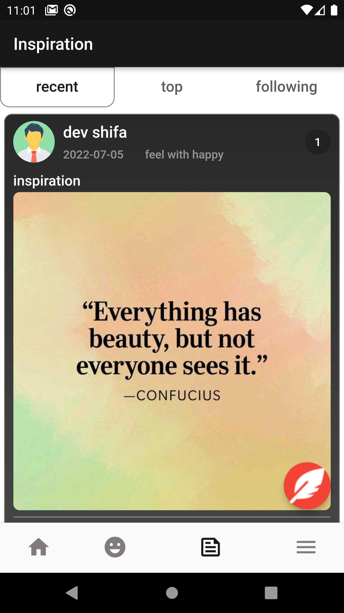

# Moody

 Moody app is a Flutter application made with integration Firebase and depend on AI on predicteing the user emotion.
 
 The AI model trained with FER2013 and Affect-Net datasets and get accuracy 85% and 86% in both FER2013 and Affect-Net respectively.

 The app depend on the detected emotion and predict movies, books, and songs that is suitable for this person according to his emotion.

 Social posts in the app is to make the person be in better mode with others posts.

## Features

- Cross platform Flutter
- Predict user feeling.
- Entertainment section prediction according to predicted feeling mode:
    - Songs.
    - Movies.
    - Books.

- Inspiration section:
    - Posts from other people.
    - Interaction with each post.
    - Recent posts.
    - Following person's posts.
- Favorite posts, books and movies section.
- Person profile view.
- Following persons in app.

## Packages
- Firebase:
    - Firebase Auth.
    - Firebase Firestore.
    - Firebase storage.
- Bloc statemanagement.
- MVVM architecture pattern.
- 
## Screenshots

  
&nbsp; &nbsp; &nbsp; &nbsp;
  
&nbsp; &nbsp; &nbsp; &nbsp;
  
&nbsp; &nbsp; &nbsp; &nbsp;
  
&nbsp; &nbsp; &nbsp; &nbsp;
  
&nbsp; &nbsp; &nbsp; &nbsp;
  
&nbsp; &nbsp; &nbsp; &nbsp;
  
&nbsp; &nbsp; &nbsp; &nbsp;
  
&nbsp; &nbsp; &nbsp; &nbsp;
  
&nbsp; &nbsp; &nbsp; &nbsp;
  
&nbsp; &nbsp; &nbsp; &nbsp;
  
&nbsp; &nbsp; &nbsp; &nbsp;
  

## Demo

## App demo link: https://drive.google.com/file/d/1D641TzbTNbvuqdrT16ueFc3wO4VIpo45/view?usp=sharing
https://user-images.githubusercontent.com/49253127/184511766-31156fe0-71db-4635-aabe-6980b4b26857.mp4

## Future work
- Integrate with Ads in the app.
- Add doctors in app to be as support to any poersons who need help from them.
- Add points to doctors when the person rate him with greater than 2/5 star
- Doctors can replace these points with cash to his account.

## 🚀 About Me
I'm a Flutter developer passionate to build applications in high performance and maintainable code.

## Authors

- [@Ahmed Ashraf](https://www.github.com/shifa99)
- [@Ahmed Belal](https://www.github.com/Ahmedbelal8)

